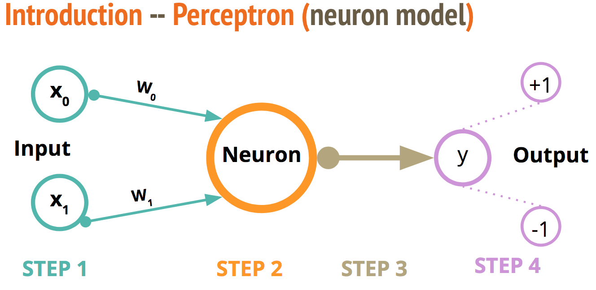

# Assignment 1 : The Perceptron

**Collaborators:**
  - Tommy Lam
  - Anirvan Shukla
  - Ryan Dorril

Here I present the origins of the perceptron and a novel description of the algorithm. For the analyses conducted, see [HERE](perceptron.ipynb)

## Origins of the Perceptron

Early attempts of simple "learning machines" were directly modeled after things found in nature. An example would be the neuron. Simple models of this cell, such as those purposed by [McCulloch-Pitts](http://www.cse.chalmers.se/~coquand/AUTOMATA/mcp.pdf) in the early 1940s, led to one of earliest and simplest learning machines, the _Perceptron_ [(F. Rosenblatt 1957)](https://blogs.umass.edu/brain-wars/files/2016/03/rosenblatt-1957.pdf). This advancement in computational neuroscience has had resounding repercussions, from the simple perceptron, to the multi-layer neural network, to the ["Neocognitron"](https://www.cs.princeton.edu/courses/archive/spr08/cos598B/Readings/Fukushima1980.pdf), to ["deep learning"](https://www.nature.com/articles/nature14539).

### Neuroscience Model of Neuron Communication

*Warning*, this is a gross over simplification. Neurons internally perform information processing on electrical action potentials. While information between neurons is mostly chemical interactions. A novel overview of the process:

1. Pre-synaptic action potential depolarizes a synaptic terminal.
1. Calcium ion channels sensitive to voltage changes open and allows calcium to enter.
1. Neurotransmitter is released.
1. Neurotransmitter binds to post-synaptic receptors.
1. Ions enter post-synaptic cell (Evoked Post-Synaptic Potential (EPSP))

## Overview of the Perceptron Algorithm

For the outline of this supervised learning algorithm, I will be referring to steps in the following sketch:


**Step 1: Inputs**
Give the "neuron" an input vector. In this notation, _x0_ and _x1_ can correspond to a pair of cartesian coordinates _x_ and _y_.

For each input start with some weight, _wi_. Recall: 0 = (B) _+ (w0)(x0) + (w1)(x1)_

**Step 2: Neuron**
With the "neuron," compute the sum from _i=0_ to _N_ number of vectors of _(xi)(wi)_.

**Step 3: Activation Function**
Convert the sum to a binary output, such as _+1_ or _-1_. Which corresponds to whether or not the "neuron" will fire. An example of such a function is,

```python
def SIGN(sum):
  if sum >= 0:
    return 1
  else:
    return -1
```

**Step 4: Update the weights**
Using the output from the neuron, inspect how does it compare the correct answer--hence the moniker of supervised learning. If the answer is correct no change is made, however if it is not we update the weight for the input vector as: _wi = xi * (learning rate) * (Error)_, where the _learning rate_ is a quantity defined a priori (discussed further in future sections) and _Error_ is the true value - the guessed value.

This process is then repeated, ideally, until all vectors are correctly classified.
